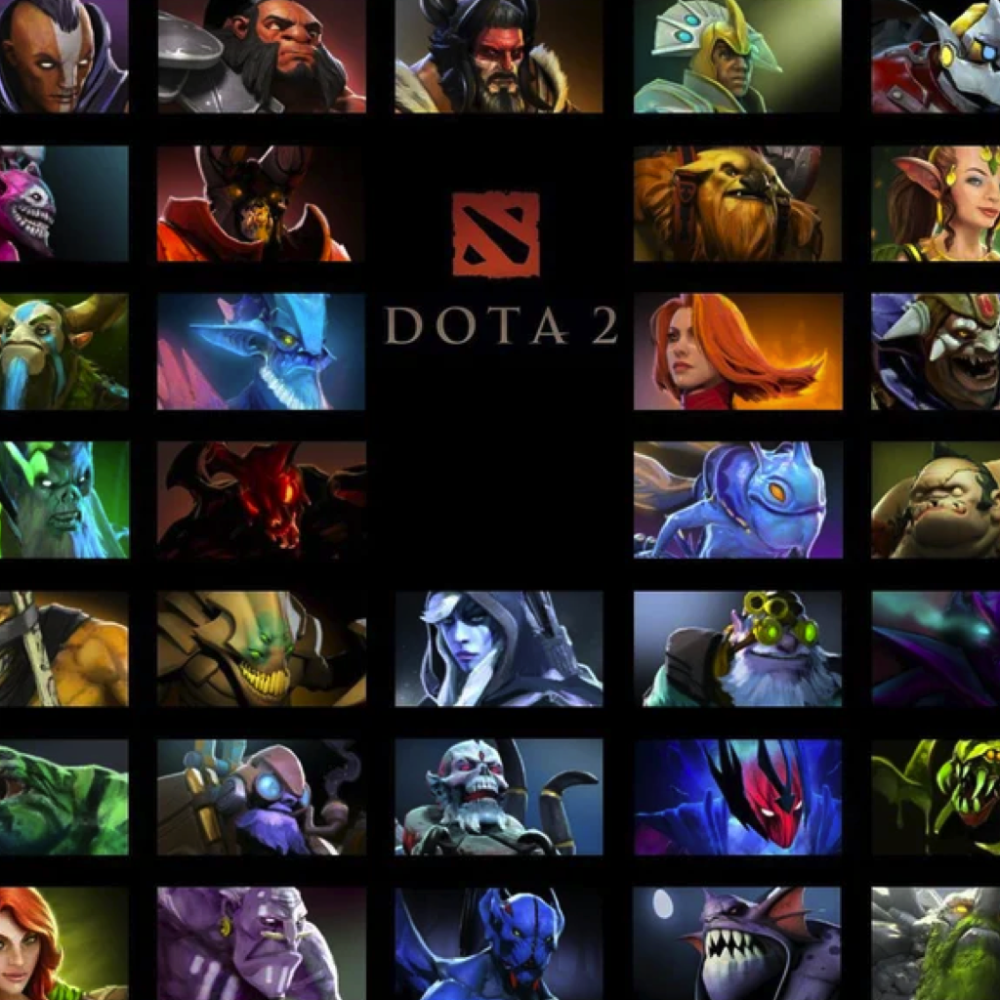
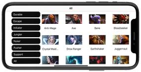

Heroes
===================


[](https://developer.apple.com/iphone/index.action)
[](https://developer.apple.com/swift)


An app to know the information of heroes status
## 🏃‍♂️ Getting Started

``` bash
git clone https://github.com/robihamanto/heroes.git
cd Heroes
open Heroes.workspace # or xed .

- Run (⌘ + R) or
- Test (⌘ + U)
```

## 👨🏻‍💻 Heroes Design
  <p float="left">
     
     
  </p>

Feature: 
- Fetch all Heroes
- Show Hero Detail Item


## 🎉 How I am building this?
1. Using [`RxSwift`](https://github.com/ReactiveX/RxSwift) 🔥
2. `MVVM` + `Coordinator` + Dependency Injection
3. Using `Codable`, [`Moya`](https://github.com/Moya/Moya), [`Kingfisher`](https://github.com/onevcat/Kingfisher).
4. Fun things!
